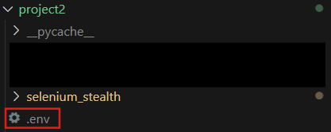
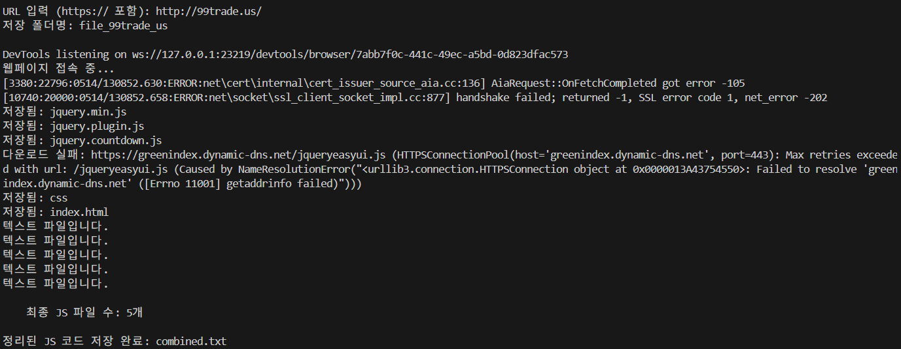
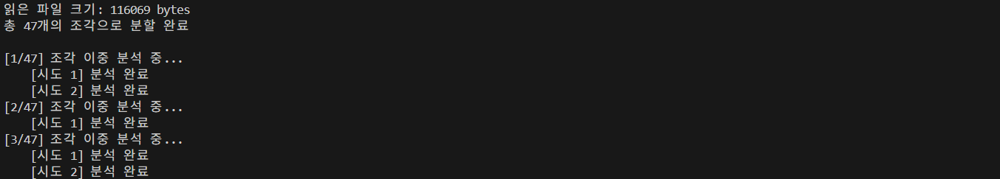
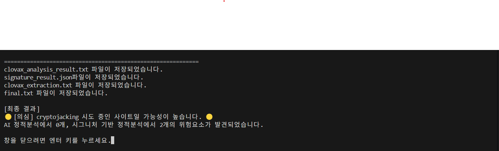

# project2
> 사이트의 **크립토재킹(Cryptojacking)** 코드를 Clova API와 시그니처로 탐지하는 도구입니다.<br/>


## 설치 방법
```bash
git clone https://github.com/jhs-322/project2.git
cd project2
pip install -r requirements.txt
python Main.py
```
<br/>

## 사용 방법
### 0. env 파일 첨부
- project2 폴더에 Clova API 키를 작성한 .env 파일을 저장합니다.


### 1. URL 입력
- 검사할 웹사이트의 URL을 입력하면,
- 해당 URL에서 JavaScript 파일만을 자동 추출하여 combined.txt 파일로 저장합니다.


### 2. JavaScript 코드 분석
- Clova API를 이용해 의심 키워드를 분석합니다. 


### 3. 결과 출력
- 전체 탐지 결과를 final.txt 파일로 저장합니다.
- 사이트의 위험도를 안전/의심/위험으로 출력합니다.

